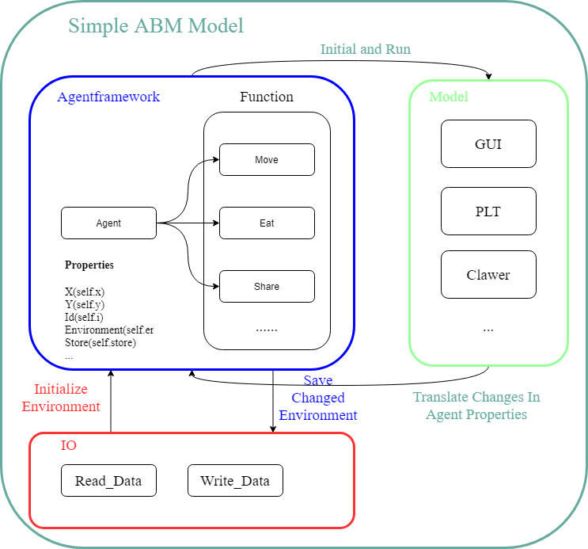

## Programming for Geographical Information Analysis: Core Skills (28787)
#python #Assighment1

### Introduction
This is the first submission for the course and contains course experiments and post-course assignments. The environment used here is the Anaconda base environment.

ABM modelling refers to agent-based modelling (ABM). Agent modelling is a computational model used to simulate the behaviour and interactions of autonomous agents (individuals or collective entities such as organisations or groups) to understand a system's behaviour and the factors that govern its outcomes [1](https://en.wikipedia.org/wiki/Agent-based_model). Such models can simulate phenomena in population, transport and the environment.

Another concept with the same name as the ABM model is Activity-Based Management (ABCM), a method for analysing and evaluating a company's business activities through activity costing and value chain analysis. The ABM approach is used to analyse the relationship between activity costs and the value added by activities to achieve operational and strategic improvements.[2](https://corporatefinanceinstitute.com/resources/management/activity-based-management-abm/)

In the financial sector, ABM models can simulate a manual centralised computing platform market environment to help participants understand, analyse and quantify the impact of changes proposed in joint publications by financial institutions.[3](https://www2.deloitte.com/uk/en/pages/audit/articles/agent-based-modelling-for-central-clearing-risk.html)

Approaches to building ABM models include using model assumptions derived from empirically observed phenomena to generate previously unknown collective behaviour through simulation and using hypothetical model assumptions to construct ABM models and reproduce empirically observed collective phenomena through simulation.[4](https://math.libretexts.org/Bookshelves/Scientific_Computing_Simulations_and_Modeling/Book%3A_Introduction_to_the_Modeling_and_Analysis_of_Complex_Systems_(Sayama)/19%3A_AgentBased_Models/19.02%3A_Building_an_Agent-Based_Model)

### Content
The process from abm1 to abm9 was a continuous refinement of the simple ABM model, during which I attempted to enrich the model's functionality and encapsulate the code into some functions according to the course. I used a jupyter notebook for the first five experiments, hence the ipynb format. After experiment 5, the format will revert to py



1. ABM1

In this chapter, basic python experiments were conducted to initially complete simple python code

2. ABM2

In this chapter, the ABM1 code is used as a basis for the unified management of target points through lists and the initial mapping is done using a third-party library

3. ABM3

In this chapter, the function to get the distance is encapsulated in a function, the function to get the maximum and minimum values is added, the function to calculate the time is done by calling a third-party library, and the function to make the point move is done initially at the end.

4. ABM4

The most significant work in this chapter is the redefinition of the initialization logic and the creation of a class to do the initialization of the points

5. ABM5

In this chapter the environmental elements of the model itself are refined, the environment is loaded by reading existing data, and a certain degree of interaction with the environment is accomplished

6.  ABM6

From this section onwards, the focus shifts from functional refinement to visual form. In ABM6, the definition of the previous classes was refined and the results were integrated into gifs

7.  ABM7

In this chapter, the original results are shown in the form of animations and the function stopping conditions are redefined

8.  ABM8

In this chapter, the basic GUI section is added to the previous code

9.  ABM9

Building on the previous section, the data source was further extended by using a crawler method to fetch the point data from the web page

10.  Streamlit

This test attempts to build a visual demonstration of the ABM model using python's streamlit library

### Usage(For streamlit)
```python
# Install streamlit first
pip install streamlit

# (if it error use)
pip install streamlit --user

# After git clone the repositories
cd ../GEOG5990M/Streamlit

# Run streamlit app
streamlit run streamlit_ABM.py
# Sometimes it not work use
python -m streamlit run streamlit_ABM.py
```

### Acknowledgments
I would like to thank Dr. Andy Turner, the course instructor, for providing the materials and lectures for this course.

### Reference

[GEOG5990 Programming for Geographical Information Analysis: Core Skills][Agent Based Model Part 8 Page (agdturner.github.io)](https://agdturner.github.io/GEOG5990/abm8/index.html)

